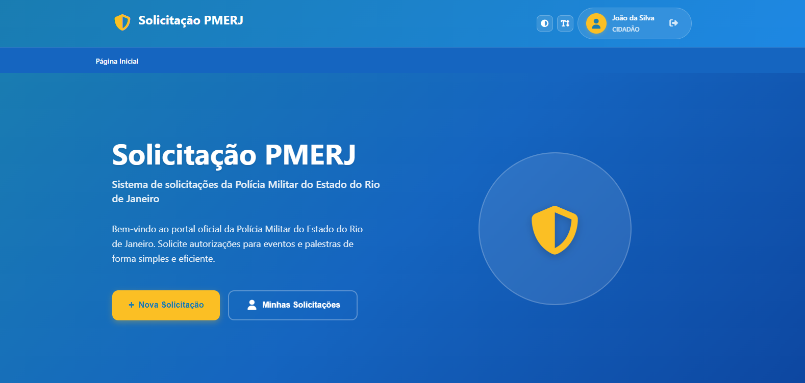
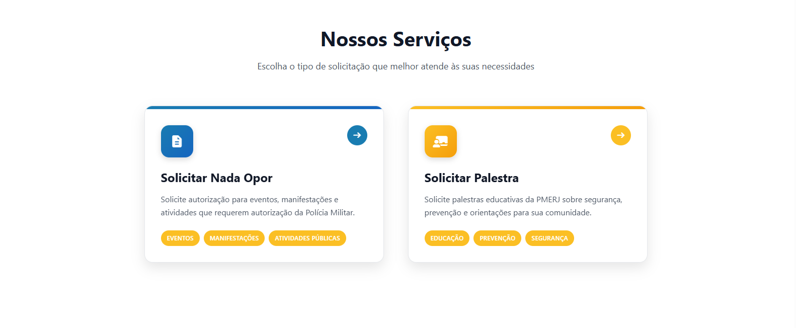
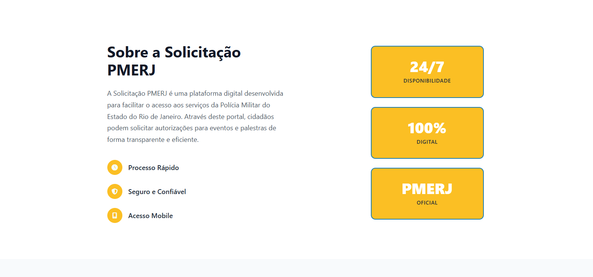
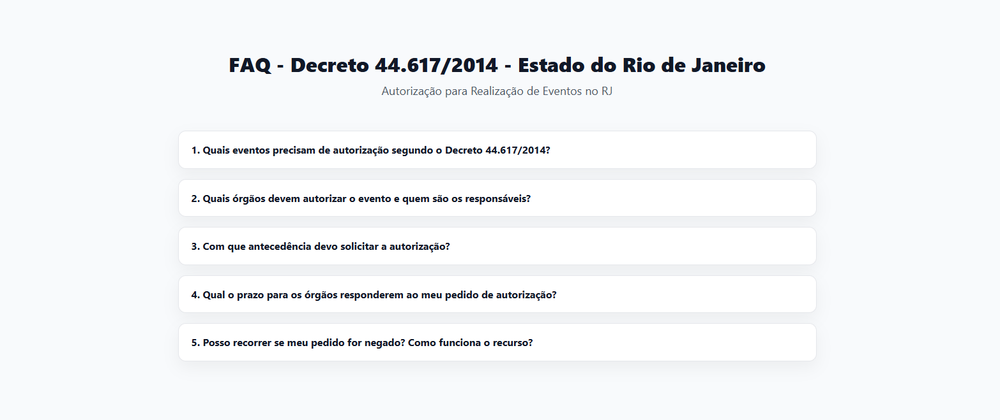
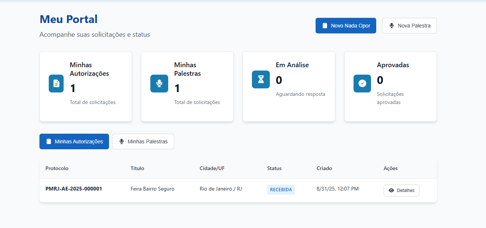
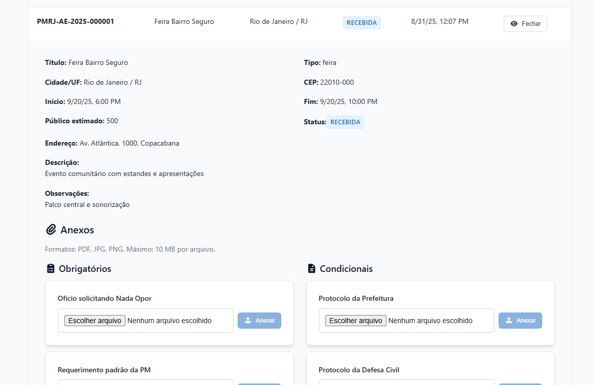
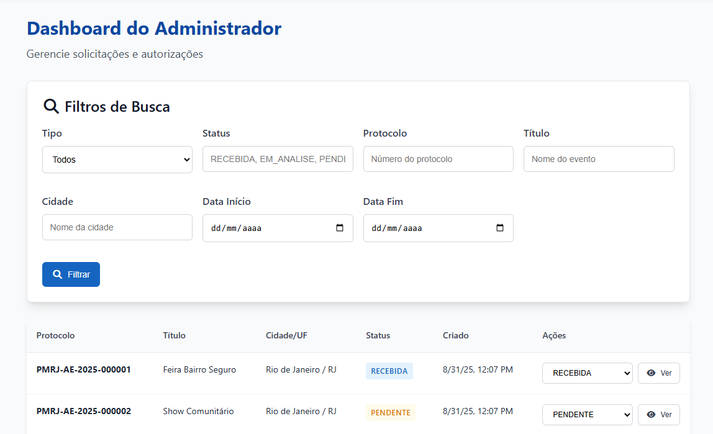
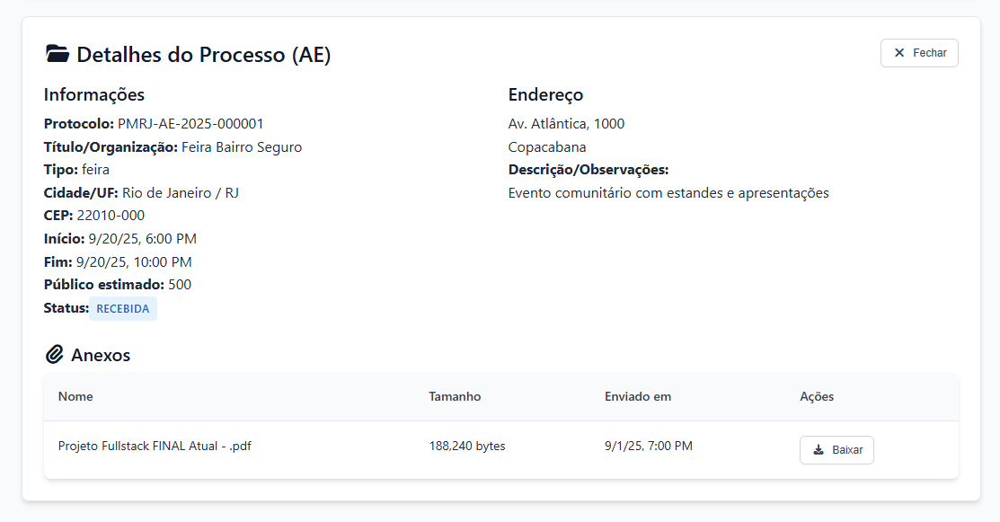

# NadaOpor2 — Portal de Solicitações PMERJ

> Plataforma para solicitações de autorizações de eventos e palestras da Polícia Militar do Estado do Rio de Janeiro (PMERJ).



## Sumário
- [Visão Geral](#visão-geral)
- [Tecnologias](#tecnologias)
- [Screenshots](#screenshots)
- [Como Rodar (Desenvolvimento)](#como-rodar-desenvolvimento)
- [Build e Push (Docker)](#build-e-push-docker)
- [Deploy em Docker Swarm](#deploy-em-docker-swarm)
- [Observações](#observações)

## Visão Geral
- **Solicitações de Nada Opor e Palestras**: fluxo simples e responsivo.
- **Autenticação com perfis**: redirecionamento automático para Dashboard do Cidadão ou do Administrador.
- **Acompanhamento de solicitações**: cards, métricas e listagens.
- **Design moderno**: foco em acessibilidade e responsividade.

## Tecnologias
- **Frontend**: Angular 20 (Standalone Components, Angular Router), TypeScript 5.8, RxJS 7.8, Zone.js, CSS puro, Font Awesome 7
- **Build/Dev (Frontend)**: Angular CLI 20, @angular/build (Vite sob o capô), Karma + Jasmine para testes
- **Backend**: Node.js, Express 5, Helmet, CORS, JSON Web Token (jsonwebtoken), dotenv, Multer (upload), mysql2 (driver), bcrypt (hash de senha), Nodemon (dev)
- **Banco de dados**: MySQL 8
- **Infraestrutura**: Docker, Docker Compose, Docker Swarm, NGINX (servidor estático com SPA fallback)
- **Formatação & Qualidade**: Prettier (override para HTML)

## Arquitetura & Módulos
- **frontend/**: SPA em Angular (componentes standalone). Servido por NGINX em produção com fallback de SPA.
- **backend/**: API REST em Express. Segurança com Helmet, CORS configurado, autenticação via JWT, upload com Multer, acesso a banco via mysql2, senha com bcrypt.
- **MySQL**: persistência de dados (Dockerizado). Scripts em `backend/banco.sql`.
- **Orquestração**: Docker Compose (dev) e Docker Swarm (produção), volumes para banco e uploads.

## Autenticação & Autorização
- **Login**: backend emite JWT com `id`, `nome`, `email`, `tipo_usuario`.
- **Guards no Frontend**: `authGuard` (verifica token) e `adminGuard` (verifica `tipo_usuario === 'ADMIN'`).
- **Perfis**: `ADMIN` e `CIDADÃO`. Redirecionamento automático pós-login e nos cliques da Home conforme o perfil.

## Uploads & Armazenamento
- **Multer**: armazenamento em disco com validação de extensão.
- **Volumes**: diretório de uploads persistido em volume Docker `uploads_data`.

## Variáveis de Ambiente (principais)
- Backend:
  - `PORT`, `DB_HOST`, `DB_USER`, `DB_PASSWORD`, `DB_NAME`
  - `JWT_SECRET`, `JWT_EXPIRES`
  - `UPLOAD_DIR` (ex.: `/data/uploads`)
- Frontend:
  - `API_BASE` (URL pública da API, injetada via `env.js` e NGINX sem cache)

Exemplo (Compose dev):
```bash
DB_HOST=db \
DB_USER=nadaopor \
DB_PASSWORD=nadaopor \
DB_NAME=nadaopor \
JWT_SECRET=changeme \
JWT_EXPIRES=8h
```

## Estrutura do Projeto (resumo)
```text
NadaOpor2/
├─ backend/
│  ├─ app.js              # app Express, middlewares gerais
│  ├─ db.js               # conexão mysql2/promise
│  ├─ rotas/              # rotas da API (auth, autorizações, etc.)
│  ├─ controladores/      # controladores
│  ├─ middlewares/        # autenticação JWT, verificação admin, etc.
│  ├─ utils/              # utilitários (ex.: senha/bcrypt)
│  └─ banco.sql           # schema inicial
├─ frontend/
│  ├─ src/app/            # Angular app (pages, components, guards, services)
│  ├─ angular.json        # config Angular
│  └─ nginx.conf          # SPA fallback e estáticos
├─ docker-compose.dev.yml
├─ docker-stack-app.yml
├─ docker-stack-db.yml
└─ README.md
```

## Requisitos de Ambiente
- Docker Desktop/Engine (recomendado)
- Opcional (dev local sem Docker):
  - Node.js 20+
  - Angular CLI 20+

## Screenshots
- Home — Seção Serviços e chamadas de ação  
  
- Home — Seção Sobre  
  
- Home — Seção FAQ  
  
- Dashboard do Usuário  
  
- Formulário de Solicitação (Usuário)  
  
- Dashboard do Administrador  
  
- Detalhe de Solicitação (Admin)  
  

## Como Rodar (Desenvolvimento)
Pré-requisitos: Docker Desktop ou Docker Engine.

1. Subir tudo (MySQL, backend, frontend):
```bash
docker compose -f docker-compose.dev.yml up --build
```
2. Acessos:
- Frontend: `http://localhost/`
- Backend API: `http://localhost:4000/api`
- MySQL: `localhost:3306` (user/pass: `nadaopor` / `nadaopor`)

Uploads persistem no volume `uploads_data`.

## Build e Push (Docker)
Troque pelo seu namespace do Docker Hub:
```bash
docker build -t automacaodebaixocusto/nadaopor-backend:latest ./backend
docker push automacaodebaixocusto/nadaopor-backend:latest

docker build -t automacaodebaixocusto/nadaopor-frontend:latest ./frontend
docker push automacaodebaixocusto/nadaopor-frontend:latest
```

## Deploy em Docker Swarm
1. Iniciar Swarm (se ainda não):
```bash
docker swarm init
```
2. Criar rede overlay externa:
```bash
docker network create -d overlay network_public
```
3. Subir banco:
```bash
MYSQL_ROOT_PASSWORD=changeme \
MYSQL_DATABASE=nadaopor \
MYSQL_USER=nadaopor \
MYSQL_PASSWORD=nadaopor \
docker stack deploy -c docker-stack-db.yml nadaopor-db
```
4. Subir app (backend + frontend):
```bash
DB_HOST=db \
DB_USER=nadaopor \
DB_PASSWORD=nadaopor \
DB_NAME=nadaopor \
JWT_SECRET=changeme \
JWT_EXPIRES=8h \
API_BASE=https://seu-dominio-ou-ip/api \
docker stack deploy -c docker-stack-app.yml nadaopor
```

## Observações
- O backend publica a porta 4000 (ingress). O frontend publica a porta 80.
- O diretório de uploads é persistido em `uploads_data` (volume local no Swarm node).
- Ajuste `API_BASE` no deploy do frontend para apontar para a URL pública da API.


# projeto-final-nadaopor-cadspm

